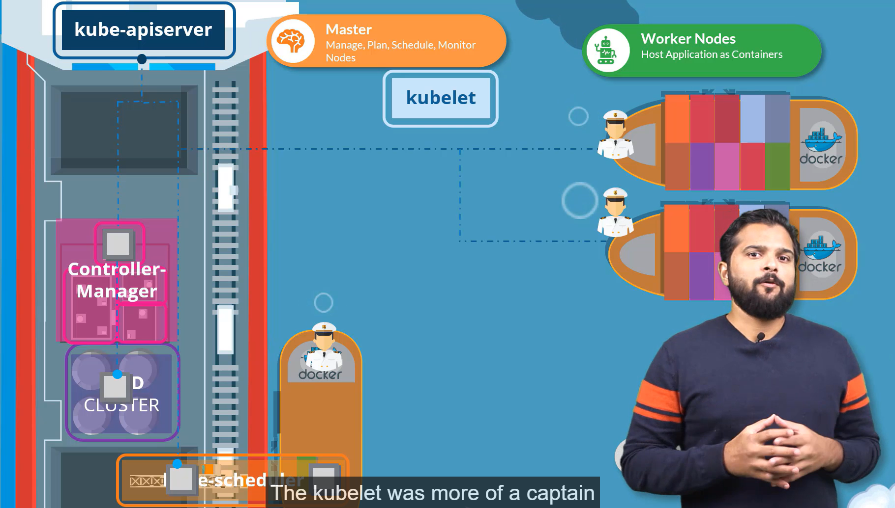
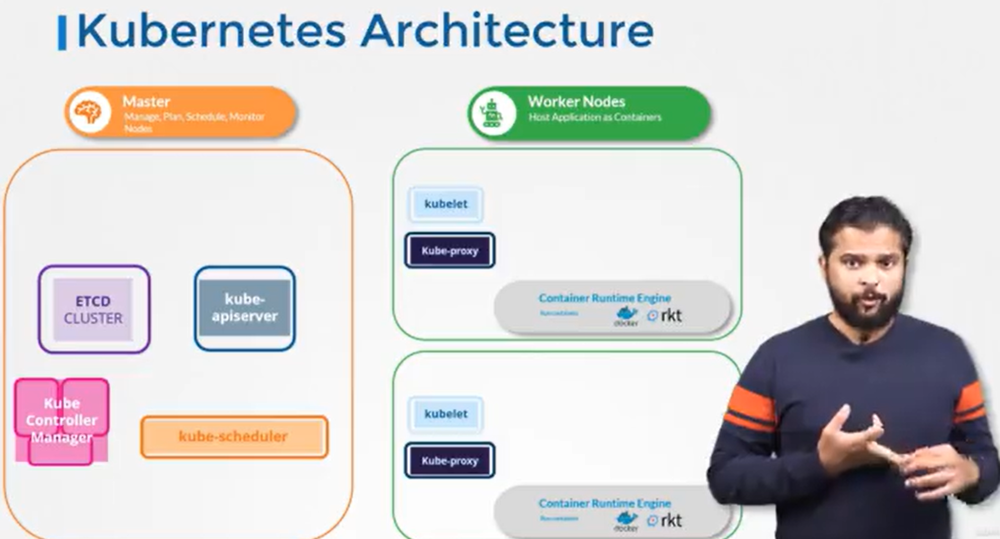
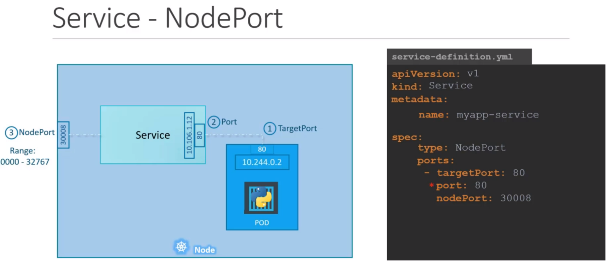
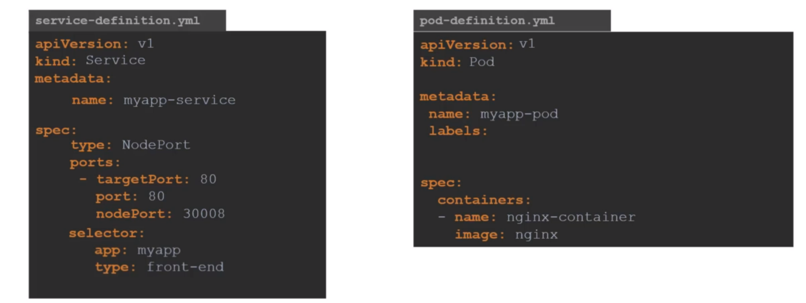
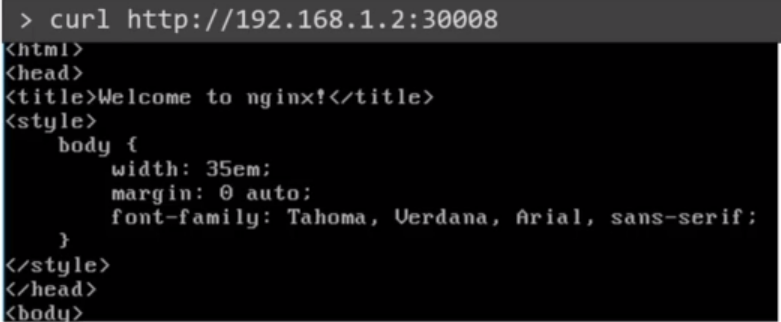
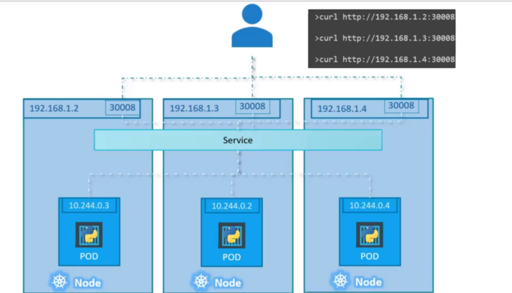
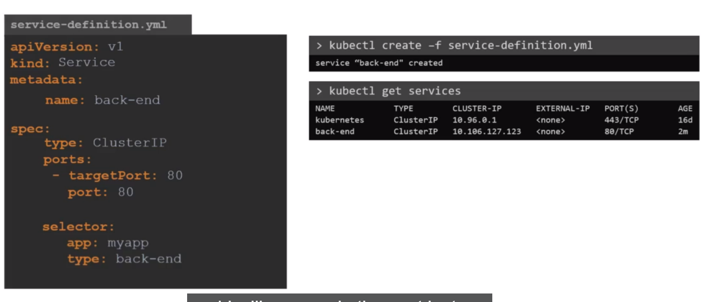
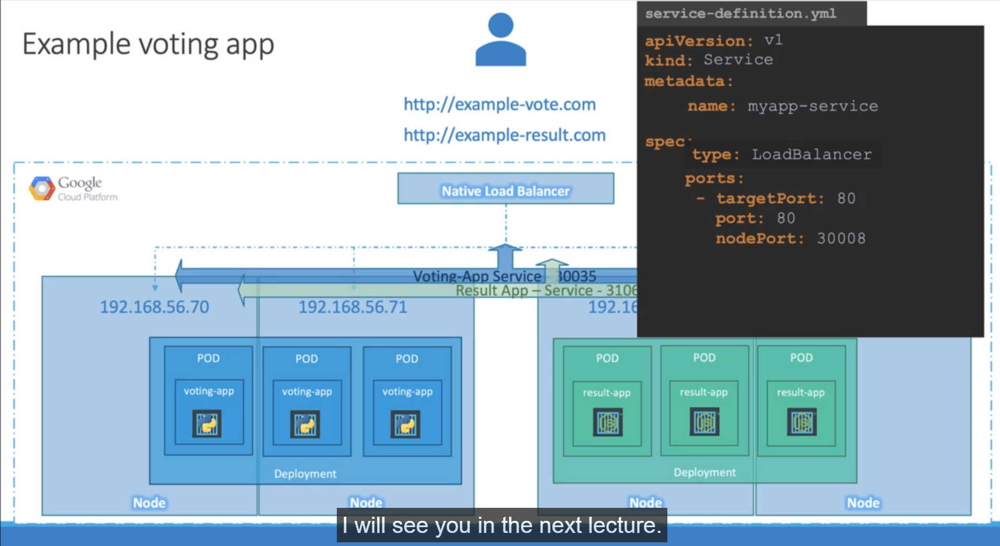

# Projet Kubernetes Learning documentation
## introduction
This page is a documentation of my Kubernetes learning in order to pass the [CKA](https://training.linuxfoundation.org/certification/certified-kubernetes-administrator-cka/) exam.
I used the official documentation and the [course of the kloud fundation & Mumshad Mannambeth on udemy](https://www.udemy.com/course/certified-kubernetes-administrator-with-practice-tests/).

The following contents are my notes in my learning journey, **ALWAYS FOLLOW THE [official documentation](https://kubernetes.io/docs/setup/)** in case of doubts or questions.
#### Outils :
* **Ubuntu_20** 
##  - Installation
You will need to follow the [official documentation](https://kubernetes.io/docs/setup/) to install K8s and his dependancy.

## 1 - Schema of the architecture



## Section 2: Core concepts and high overview of components


### Master 
#### Manage, plan, Schedule and monitor nodes
- ETCD Cluster:
Db that store informations about the cluser in key/value
- Kube Controller Manager: 
Node controller, replication controller etc
- kube-scheduler:
Responsible for scheduling application/container on nodes
- Kube-apiserver:
Responsible for orchestring all operations within the cluster
### Worker Nodes
#### Host Application a Container
- Kubelet:
Lisen for instruction from the kube-apiserver and manager container.
- Kube-proxy:
Enable communication between service within the cluster
- Container runtime (docker, rkt etc):
Run the container

----
#### ETCD
ETCD records, nodes, pods, configs, secrets, accounts, binding, roles and other.

There is two differents way of deploying ETCD :
 - From scratch, you download the binary and configure it as a service yourself in the master nodes
 - Kubeadm, it deploy it for you as a pod:
 ```bash
 kubectl get pods -n kube-system
 ```
 To list every keys that are store in the ETCD database :
 ```bash
 kubectl exec etcd-master -n kube-system etcdctl get / --prefix -keys-only
 ```
 Here are some usefull commands: 
 For example ETCDCTL version 2 supports the following commands:

 ```bash
etcdctl backup
etcdctl cluster-health
etcdctl mk
etcdctl mkdir
etcdctl set
 ```


Whereas the commands are different in version 3

 ```bash
etcdctl snapshot save 
etcdctl endpoint health
etcdctl get
etcdctl put
 ```

To set the right version of API set the environment variable ETCDCTL_API command

export ETCDCTL_API=3

#### Kube-apiserver
If you do a kubeadm install, you can find the binary in the kubebernetes release page.
As the ETCD, you will need to configure it as a service in the master node. 

Kube-apiserver is responsible for : 
1. Authentificate User
2. Validate request
3. Retrive Data
4. Update ETCD
5. Schduler
6. Kubelet

Is the only one interacting directly with the ETCD data store.
The other component such as the scheduler, kube-controller-manager and kubelet uses the API server to perform update in the cluser in their respective aera.


#### Kube-controller-manager
- *Watch status*
- *Remediate situation*
In kubernetes terms, a controller is a process that continuously monitor the state of various components within the system and work toward bringind the whole system to the desire functionning state.

Here are two exemple of controllers: 
- **Node-controller**:
The node-controller watch status, remediate situation, node monitor period = 5s, node monitor grace period = 40s, POD eviction timeout = 5 min
- **Replication-controller**: 
It is responsible to monitor the status of replica sets and ensuring that the desired number of PODS are available at all time. If a POD dies, it create another one.

But there is a long list of controllers;
Deployement, CronJob, service-account, nodes, namespaces, endpoints, Job, statefull-Set, Replicaset, PV-protection, PV-Binder, replication.

They are all located as a single process  known as *Kube-controller-manager*.

If you set up the *Kube-controller-manager* with the Kube admin tool, you can view it as a POD with :
```bash
kubectl get pods -n kube-system
``` 
in the kube-system namespace on the master node.
In a non-admin set up, you can inspect the options by viewing the service located : 
```bash
cat /etc/systemd/system/kube-controller-manager.service
or 
ps -aux | grep kube-controller-manager
```

#### Kube-Scheduler
Is only responsible for deciding which pod goes on which node.
It doesn't place them on the node, the kubelet(captain) does.
1. Filter nodes
2. Rank nodes


#### Kubelet
There are the one doing the work ask by the Master, they load and unload container on the ship as instructed by the scheduler and send back status on the node and the container on them.

- *Register nodes*
- *Create PODs*
- *Monitor Node & PODs*
If you use the kubeadm tool to deploy your cluster, **it doesn't automaticaly deploy kubelet** 
To view kubelet options: 
```bash
ps -aux | grep kubelet
```

#### Kube-proxy
Allow nodes to communicate with each other. It is a **process** deploy on a service expl:"*service:db*" with a static IP address and forward the trafic from a application node to a db node in this exemple through ip-tables on each node. **The service is not a POD, it only live in the kubernetes memory** 

You can install kube-proxy by downloading it on the [kubernetes release page](https://kubernetes.io/docs/reference/command-line-tools-reference/kube-proxy/) 

The *kubeadm* tool deploy it as pods on each node as DaemonSet so a single pod is always deploy on each node on the cluster.
```bash
kubectl get pods -n kube-system
```
NAME : kube-proxy-{{id}}
```bash
kubectl get daemonset -n kube-system
```

#### PODs
PODs(process on nodes) are the smallest unit in a *kubernetes cluster*.
A Pod represents a single instance of a running process in a cluster, and it can contain one or more containers. All containers in a Pod share the same network ***namespace***, which means they can all communicate with each other using *localhost*, and they can all access the same storage volumes. This makes it easy to run multiple containers that need to communicate with each other as part of a single application.
*Exemple with a nginx image*:
```bash
kubectl run nginx --image nginx
```
it deploy a docker container by creating a *POD*.
The *--image* parameter specify the image from the [docker Hub](https://hub.docker.com/) repository.

To list all pods deploy on your cluster:
```bash
kubectl get pods
```

#### ReplicaSets
ReplicaSets is one of the principal controller.
***High availability***
The replication controller help us run multiples instances of a single Pod in a kubernetes cluster, thus providing us with high availability. 
It unsure that the specified number of Pods are running at all times, even if it's 1 or 100.
***Load balancing & Scaling***
It create multiple Pods to share the load across them.
The controller spans across multiple nodes in a cluster.
*Replication controller* and *Replica Set* are not the same but share the same purpose. The replication controller is the older version and replica set the newer version.
To create a replication controller from a yaml file:
```bash
kubectl create -f rc-definition.yaml
```
to view the replication created:
```bash
kubectl get replicationcontroller
```
When you need to update a replica by modifying the yaml, for exemples; the number of replica Set.
You can update the replica set with the command
```bash
kubectl replace -f rc-definition.yaml
```
Another way to do it is with the command *scale*:
```bash
kubectl scale --replicas=6 -f rc-definition.yaml
or
kubectl scale --replicas=6 -f replicaset myapp-replicaset
replicaset being the TYPE and myapp-replicaset the NAME
```
You can delete or replace all underlying PODs of a replicaSet with :
```bash
kubectl delete/replace replicaset myapp-replicaset
```

#### Services: 
Kubernetes services help us connect applications together with other applications or users. Services enable loose cooupling between micro-services in our applications.
Services is an object just like pods, replicaset etc. One of his use case is to lisen to a port on the node and forward request on that port to a port on that POD running the web application.

**Services Types**:
- ***NodePort*** :
Service make a internal POD accessible by mapping port on the node to a port on the POD.

You then need to move the labels in the PODs definition file into the service definition file in the selector section, like in the exemple : 

Once done you can create your service with kubectl create -f + {{yamlFile}} 
```bash
kubectl create -f service-definition.yml
```
You can then access it by curling it : 

In a case of singles PODs on multiple nodes, since each node share the same label, you will be able to ping each node IP on the same port: 

- ***ClusterIP*** :
The service create a virtual IP inside the cluster to enable communication between differents services such a

To create such a service, you can move the labels into the selector part of your service-definition.yaml



- ***LoadBalancer*** :
It provide a load balancer for our application in supported cloud provider. Exemple: To distribute load across the different web servers in your frontend tier. 


#### Namespaces
Namespace are a way to isolate differents resources in a cluster. By default, kubernetes create 3 namespaces, the kube-system, default and kube-public. In large project, you should create namespace for every group of resources, exemple: project name, prod vs dev environment. You can also allow a amount of ressources limits by namespace.
To switch a to another namespace, dev for exemple:
```bash
kubectl config set-context $(kubectl config current-context) --namespace=dev
```
You can add the --namespace= argument to specify in which namespace you want your command to be executed : 
```bash 
kubectl get pods --namespace=dev
```
--all-namespace to target every namespace on the machine

**To limit resources in a namespace**:
You can use ***resource quota***: 
```bash 
kubectl create -f compute-quota.yaml
```

#### Imperative vs declarative 
We saw differents way to creating resources in kubernetes through command line or with files. In the IAC(infrastructure as code), [terraform](https://developer.hashicorp.com/terraform/intro) for exemple, you can use both.
- ***Imperative***:
1. Provision a VM by the name 'web-server'
2. Install Nginx Software on it
4. Edit configuration file to use port '8080'
5. Load web pages to '/var/www/ngin x' from GIT Repo - X
6. Start NGINX server

- ***Declarative***:
```bash 
VM Name: web-server
package: nginx
Port: 8080
Path: /var/www/nginx
Code: GIT Repo - X
```

## Section 3: Scheduling

#### Manual scheduling:
Every POD has a field called nodeName that is not set by default, k8s add it automatically.
The scheduler goes through all the pods that don't have it specify and then identifies the right node for the POD. Once identified, it schedules the POD on the node by setting the nodeName property by the name of the node by creating a binding object.
If there is no scheduler to monitor and schedules node, the PODS stay in a pending state. You can mannualy assigns PODs to nodes yourself. Simply set the nodeName yourself while creating the POD. He then gate asign to the specify node.
If u want to assigns a existing POD, u can create a Binding ressource, and a post request to the POD binding API, you must convert you yaml file to his json equivalent.  
## Section 4: Logging & Monitoring

## Section 5: Application Lifecycle Management

## Section 6: Cluster Maintenance

## Section 7: Security

## Section 8: Storage

## Section 9: Networking

## Section 10: Design and Install a Kubernetes Cluster

## Section 11: Install "Kubernetes the kubeadm way"

## Section 12: End to End Test on  a Kubernetes Cluster

## Section 13: Troublesshooting

## Section 14: Other Topics

## Certification Tips - Imperative Commands with Kubectl
While you would be working mostly the declarative way - using definition files, imperative commands can help in getting one time tasks done quickly, as well as generate a definition template easily. This would help save considerable amount of time during your exams.

Before we begin, familiarize with the two options that can come in handy while working with the below commands:

```bash--dry-run```: By default as soon as the command is run, the resource will be created. If you simply want to test your command , use the ```--dry-run=client``` option. This will not create the resource, instead, tell you whether the resource can be created and if your command is right.

```bash-o yaml```: This will output the resource definition in YAML format on screen.


Use the above two in combination to generate a resource definition file quickly, that you can then modify and create resources as required, instead of creating the files from scratch.


####POD
Create an NGINX Pod

kubectl run nginx --image=nginx


Generate POD Manifest YAML file (-o yaml). Don't create it(--dry-run)

```kubectl run nginx --image=nginx --dry-run=client -o yaml```


#### Deployment
Create a deployment

```kubectl create deployment --image=nginx nginx```


Generate Deployment YAML file (-o yaml). Don't create it(--dry-run)

```kubectl create deployment --image=nginx nginx --dry-run=client -o yaml```


Generate Deployment with 4 Replicas

```kubectl create deployment nginx --image=nginx --replicas=4```


You can also scale a deployment using the kubectl scale command.

```kubectl scale deployment nginx --replicas=4```

Another way to do this is to save the YAML definition to a file and modify

```kubectl create deployment nginx --image=nginx --dry-run=client -o yaml > nginx-deployment.yaml```


You can then update the YAML file with the replicas or any other field before creating the deployment.


To create the pod and the service named httpd using the image httpd:alpine targeting for exemple the port 80 :
```kubectl run httpd --image=httpd:alpine --port=80 --expose```
#### Service
Create a Service named redis-service of type ClusterIP to expose pod redis on port 6379

```kubectl expose pod redis --port=6379 --name redis-service --dry-run=client -o yaml```

(This will automatically use the pod's labels as selectors)

Or

```kubectl create service clusterip redis --tcp=6379:6379 --dry-run=client -o yaml ``` (This will not use the pods labels as selectors, instead it will assume selectors as app=redis. You cannot pass in selectors as an option. So it does not work very well if your pod has a different label set. So generate the file and modify the selectors before creating the service)


Create a Service named nginx of type NodePort to expose pod nginx's port 80 on port 30080 on the nodes:

```kubectl expose pod nginx --type=NodePort --port=80 --name=nginx-service --dry-run=client -o yaml```

(This will automatically use the pod's labels as selectors, but you cannot specify the node port. You have to generate a definition file and then add the node port in manually before creating the service with the pod.)

Or

```kubectl create service nodeport nginx --tcp=80:80 --node-port=30080 --dry-run=client -o yaml```

(This will not use the pods labels as selectors)

Both the above commands have their own challenges. While one of it cannot accept a selector the other cannot accept a node port. I would recommend going with the kubectl expose command. If you need to specify a node port, generate a definition file using the same command and manually input the nodeport before creating the service.

Reference:
https://kubernetes.io/docs/reference/generated/kubectl/kubectl-commands

https://kubernetes.io/docs/reference/kubectl/conventions/